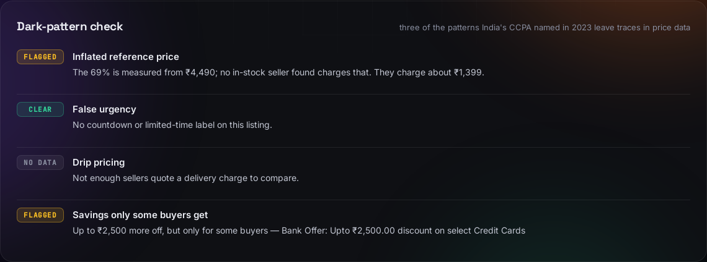
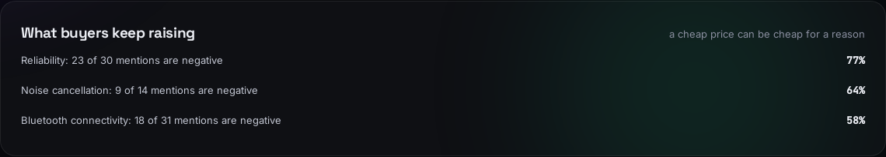
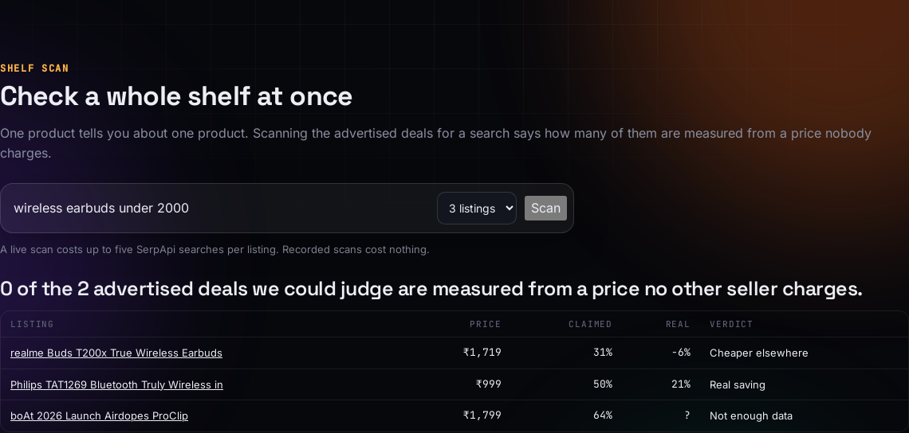

# AsliDeal

**Is that "% off" real?** AsliDeal takes an Amazon.in listing and checks its discount against what other Indian stores charge for the same product today.

Amazon.in shows almost every product with a struck-through M.R.P. and a big percentage off. The M.R.P. is a legal maximum printed on the box, not the price anyone actually sells at. So "69% off" can mean a real bargain, or it can mean every store sells it at that price. AsliDeal tells you which, and shows the evidence.


> **boAt Airdopes Prime 412**: Amazon.in shows ₹1,399, "69% off" an M.R.P. of ₹4,490. Flipkart and Zepto both sell it for ₹1,399, and no in-stock seller charges ₹4,490. Against the market, the saving is 0%.


Each report shows the verdict as two gauges (claimed discount vs real saving), every matching seller on one price axis with the M.R.P. and street price marked, the SerpApi calls that produced the evidence, and every listing that was left out and why. Checks can also come out the other way, as with the JBL Tune 520BT, where Amazon is really 17% cheaper: [report](docs/jbl-report.png).

**Demo video** (2 min 36 s, narrated): [`docs/asli-deal-demo.mp4`](docs/asli-deal-demo.mp4)

## Run it

```bash
./run.sh            # http://localhost:8000
```

That's it. With no API key it runs in **demo mode** on the recorded SerpApi responses in `fixtures/cache/`: click any product in the "Checked products" gallery to see a full report. Nothing is fetched from the network.

To check any product live, get a free key at [serpapi.com](https://serpapi.com), then:

```bash
cp .env.example .env    # put your key after SERPAPI_KEY=
./run.sh
```

Paste an amazon.in product link, or type a product name and pick the exact listing.

Needs Python 3.9 or newer. Tests, after `./run.sh` has run once to create the environment: `cd backend && .venv/bin/python -m pytest`.

## The Chrome extension

`extension/` puts the verdict on the Amazon.in product page itself, so you never have to leave it.


Load it in Chrome: `chrome://extensions` → Developer mode → **Load unpacked** → pick the `extension/` folder. Then open any amazon.in product page.

**It needs the app running locally.** The panel asks `http://localhost:8000` for the verdict, so start `./run.sh` first; without it the panel says so. The extension is a thin client: all the checking happens in the same backend, and the demo data works here too, so recorded products answer with no API key.

## The dark-pattern check

India's CCPA named thirteen dark patterns in its 2023 guidelines, and three of them leave traces in price data. Every report scores the listing against them, saying only what the prices show:



| Check | Flagged when |
|---|---|
| Inflated reference price | The "% off" is measured from an M.R.P. no in-stock seller charges |
| False urgency | A "Limited time deal" label that never says when it ends |
| Drip pricing | The cheapest sticker price isn't cheapest once delivery is added |
| Savings only some buyers get | The headline saving needs a particular card or coupon |

## Cheap for a reason?

Amazon's own review insights sit next to the price, so a genuine discount on an unreliable product doesn't read as a win:



## Scan a whole shelf

One product tells you about one product. A shelf scan checks the advertised deals for a search and says how many hold up:



A live scan of "wireless earbuds under 2000" found one listing advertising **31% off that is actually 6% dearer** than other stores, and one genuine 21% saving. It costs up to five searches per listing.

## Check from a photo

Paste the address of a product photo and SerpApi's `google_lens` engine names the product, then AsliDeal looks it up on Amazon.in. Lens usually quotes seller prices with its matches, which the page shows as a first sighting of the market.

## Price history, kept by the app itself

SerpApi has no price history, so AsliDeal keeps its own: every live check records what it saw that day (Amazon's price, the M.R.P., the street price, the verdict) in `fixtures/history.json`, one reading per product per day. Check the same product next week and the report says what moved — including a change in the M.R.P. itself, which is the interesting one.

Replays from the cache are never recorded, so the demo data stays as it was.

## A card you can share

**Save image** on any report draws a 1200×630 PNG of the verdict:


## How SerpApi is used

Every verdict comes from six SerpApi engines. There's no other data source.

| Engine | What it provides |
|---|---|
| `amazon_product` | **The claim:** the listing's exact title, brand, price, M.R.P. (`old_price`) and stock, by ASIN |
| `amazon` | Product-name search on amazon.in, so the user can pick the exact listing |
| `google_shopping` (`gl=in`) | Indian sellers' listings and prices for the model |
| `google` web search (`gl=in`) | More sellers from the popular-products block, plus retailer pages (Flipkart, Vijay Sales, the brand's own store) whose snippet carries a price and stock status |
| `google_immersive_product` | Every store behind a grouped Google product, with price, delivery and stock |
| `google_lens` | Names a product from a photo, and recognises sellers and prices in the listing's own image when the other engines come up short |

A live check costs at most five searches. Every response is cached on disk, so repeating a check is free. The cache also serves as the demo data.

## How a verdict is reached

1. **Claim.** Amazon.in price *P* and M.R.P. *M*, so the claimed discount is `1 - P/M`.
2. **Evidence.** All listings found by the three Google engines.
3. **Matching.** This is the hard part, because a wrong comparison is worse than none. A listing counts only if:
   - it names the same model, with the words in order and side by side. boAt sells both *Airdopes Prime 412* earbuds and *Rockerz 412* headphones, and *Pro 6* is not *Air Buds Pro 6*.
   - it has no extra tier word (*Pro*, *Max*, *Plus*, *Pro+*...).
   - it has the same memory, when the listing states one (8GB/128GB vs 8GB/256GB).
   - it isn't an accessory, a spare part, or a renewed unit.
   - it's in stock, sold in India, not an EMI or financing listing, and not an import reseller.
   - it's priced at no more than 110% of the printed M.R.P. (a listing well above it is an import or a different item), and at no less than 40% of Amazon's price (below that, it's a part or a mislabelled listing).

   Each seller counts once. Every rejected listing is shown in the report with its reason.
4. **Street price.** The median of the other in-stock sellers. Amazon's own listings are never evidence for Amazon's claim.
5. **Verdict.**

| Verdict | When |
|---|---|
| Real saving | Amazon is at least 10% below the street price |
| Discount from a price nobody charges | Claimed discount ≥ 20%, but Amazon is less than 10% below (and at most 5% above) the street price, and no in-stock seller charges the M.R.P. |
| Normal price | Close to the street price, with no big claim |
| Cheaper elsewhere | At least 5% above the street price |
| Not enough data | Fewer than two other in-stock sellers of the exact product |

The wording states what the prices show and nothing about intent.

## Measured coverage

`backend/scripts/evaluate.py` runs two fixed sets of Amazon.in listings, all showing an M.R.P. Sets are frozen by ASIN and never edited to improve the score. Set A was fixed on 2026-09-18 (three of its products were also used while developing the matcher); set B on 2026-09-20, chosen to be awkward on purpose: other categories, titles with no model number, a listing whose brand Amazon's search doesn't name.

| Set A (2026-09-18) | Verdict |
|---|---|
| boAt Airdopes Prime 412 | Discount from a price nobody charges: "69% off" ₹4,490, market ₹1,399 |
| JBL Tune 520BT | Real saving: 17% below 6 other sellers |
| Philips HL7756 mixer grinder | Real saving: 10% below 3 other sellers |
| Prestige PIC 20 induction cooktop | Real saving: 13% below 10 other sellers |
| Redmi Note 14 Pro 5G (8/128) | Cheaper elsewhere: 15% above the ₹22,644 that 4 sellers charge |
| Samsung Galaxy M36 5G | Cheaper elsewhere: 5% above 4 other sellers |
| Noise Pro 6 smart watch | Not enough data: two sellers, ₹5,499 and ₹8,999, no going rate |
| Samsung Galaxy M56 5G | Listing unavailable on Amazon.in; live listings suggested instead |

| Set B (2026-09-20) | Verdict |
|---|---|
| Havells Instanio 3L water heater | Discount from a price nobody charges: "31% off" ₹5,290 |
| Prestige Iris 750W mixer grinder | Real saving: 45% below 3 other sellers |
| boAt Rockerz 255 Pro+ | The going rate: 9 other sellers at about ₹1,199 |
| Milton Thermosteel flask 1L | The going rate: 3 other sellers at about ₹1,052 |
| Philips hair straightener | The going rate: 4 other sellers at about ₹2,032 |
| Nivea Men face wash 100g | Not enough data: one other seller |

**11 of 14 reach a verdict**, up from 5 of 14. Everything else says so instead of guessing.

### What moved the number

- **Google Lens as a price source.** Lens recognises the product in the listing's own photo and names the shops it sees, with prices — a different index from Google Shopping's. It runs only when the other engines come up short, and it took coverage from 5 of 14 to 11 of 14 for 7 searches.
- **Careful reading of what Lens returns.** Lens sometimes puts the page title where the shop's name belongs, so the seller is taken from the link's hostname instead, and a Facebook post quoting a price is not counted as a shop.
- **Refusing a street price from two sellers who disagree.** The Noise watch had one seller at ₹5,499 and one at ₹8,999; the median between them is a price neither charges, so it now says so.

Earlier attempts that changed nothing on these sets are kept in the history: a shorter fallback search, manufacturer model codes, reading both halves of a Google rich snippet, and size normalisation ("3 L" = "3L"). Two of those did make results *more correct*: the Prestige PIC 20's evidence went from 2 sellers to 10, and the Prestige Iris stopped being priced against the 3-jar version of the same mixer.

## Limitations

- It's a snapshot of today's prices. SerpApi has no price history, so the tool can't say whether a price was raised before a sale.
- Only in-stock sellers indexed by Google count as evidence.
- Matching is deliberately strict. Some real matches are rejected (e.g. a seller who writes "ColorFit Pro 6" for Amazon's "Pro 6").

## Layout

```
backend/aslideal/serp.py      SerpApi client with disk cache and demo mode
backend/aslideal/match.py     same-product rules
backend/aslideal/pipeline.py  claim -> evidence -> filters
backend/aslideal/verdict.py   street price and verdict
backend/aslideal/api.py       FastAPI + the page in web/
backend/tests/                matcher, verdict and end-to-end tests on recorded data
fixtures/cache/               recorded SerpApi responses (no keys)
```
